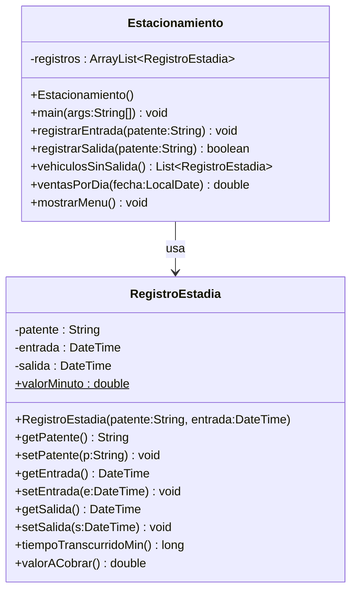

# Sistema de Estacionamiento — Diseño (Markdown)

## Enunciado (simple)
Se desea implementar un sistema de estacionamiento básico. Cada vehículo genera un **registro** con su **patente** (`String`), **hora de entrada** (`DateTime`) y **hora de salida** (`DateTime`, vacía mientras no salga).  
La clase del registro debe ofrecer **constructores**, **getters y setters**, además de:
- `tiempoTranscurrido()`: calcula el tiempo entre entrada y salida (o entre entrada y “ahora” si aún no sale), redondeado al **minuto más próximo**.
- `valorACobrar()`: calcula el monto según un **valor por minuto estático** de la clase.

Existe una clase `Estacionamiento` con `main` que mantiene un `ArrayList` de registros y un **menú** con opciones:  
1) **Entrada de vehículo**  
2) **Salida de vehículo**  
3) **Listar vehículos sin salida** (con tiempo transcurrido)  
4) **Listado de ventas para un día dado**

---

## Diagrama de clases (Mermaid)

**Notas de diseño**
- `valorMinuto` es **estático** para que el precio por minuto sea común a todos los registros.  
- El redondeo al **minuto más próximo** puede implementarse como:
  - `minutos = Math.round(Duration.between(entrada, salidaOActual).getSeconds() / 60.0);`
- Si un vehículo no ha salido, `tiempoTranscurridoMin()` usa el **instante actual**.
- `ventasPorDia(fecha)` suma `valorACobrar()` de los registros cuya **salida** cae en la fecha indicada.

---

## Borrador de flujo del menú (referencial)

- **1. Entrada de vehículo**: pide `patente`, crea `RegistroEstadia(patente, now)` y lo agrega a `registros`.  
- **2. Salida de vehículo**: pide `patente`, busca el registro sin salida, setea `salida = now`, muestra `tiempoTranscurridoMin()` y `valorACobrar()`.  
- **3. Vehículos sin salida**: lista `patente` y `tiempoTranscurridoMin()` calculado con “ahora”.  
- **4. Ventas por día**: pide `yyyy-MM-dd`, filtra registros cuya `salida` ∈ ese día, suma `valorACobrar()` y muestra total.  

> ¿qué pasa si cambiamos el precio por minuto? ¿a qién afecta?, ¿qué pasa con la información histórica?