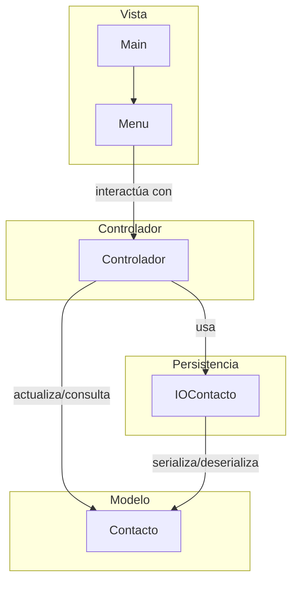
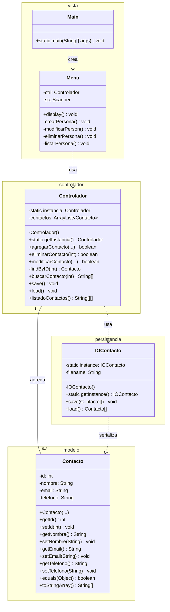
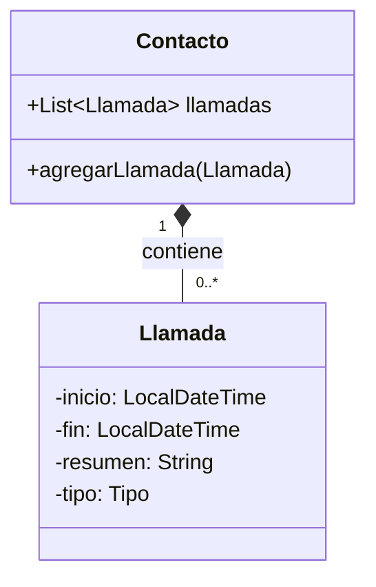

# Agenda de Contactos con Serialización

Este proyecto es una aplicación de consola simple para gestionar una agenda de contactos. Permite crear, leer, actualizar y eliminar (CRUD) contactos, y persiste la información en un archivo binario utilizando la serialización de objetos de Java.

## Arquitectura

El proyecto sigue una variación del patrón de diseño **Modelo-Vista-Controlador (MVC)**, con un paquete adicional para la persistencia de datos.

*   **Modelo:** Contiene la clase `Contacto`, que representa la entidad de datos de la aplicación.
*   **Vista:** Compuesta por las clases `Menu` y `Main`, se encarga de la interacción con el usuario a través de la consola.
*   **Controlador:** La clase `Controlador` actúa como intermediario entre el Modelo y la Vista, gestionando la lógica de la aplicación.
*   **Persistencia:** El paquete `persistencia` maneja la lectura y escritura de los objetos `Contacto` en un archivo.

A continuación se muestra un diagrama de las relaciones entre los componentes:



## Diagrama de Clases

A continuación se muestra un diagrama de clases que incluye los paquetes, clases, atributos, métodos y las relaciones entre ellos.



*   **Main**: Punto de entrada que crea y ejecuta el `Menu`.
*   **Menu**: Recibe la entrada del usuario e invoca al `Controlador`.
*   **Controlador**: Orquesta las operaciones, maneja la lista de `Contacto` y utiliza `IOContacto` para la persistencia.
*   **Contacto**: La clase de datos (modelo) que representa un contacto.
*   **IOContacto**: Gestiona la lectura/escritura de los objetos `Contacto` al disco.

## Cómo ejecutar

1.  Compile todos los archivos `.java`.
2.  Ejecute la clase `Main` desde la raíz del proyecto:
    ```bash
    java ejemplos.semana10.MVC_Serializacion.vista.Main
    ```

## Nueva funcionalidad

Se solicita agregar una nueva funcionalidad para mantener un registro de llamadas por cada contacto.

Para ello, se deben implementar las siguientes características:

1.  **Crear una nueva clase `Llamada`** que contenga la siguiente información:
    *   `inicio`: `LocalDateTime` - Fecha y hora de inicio de la llamada.
    *   `fin`: `LocalDateTime` - Fecha y hora de finalización de la llamada.
    *   `resumen`: `String` - Un breve resumen o notas sobre la llamada.
    *   `tipo`: `Tipo` - Un enumerado que indique si la llamada fue `ENTRANTE` o `SALIENTE`.

2.  **Definir el enumerado `Tipo`**:
    ```java
    public enum Tipo {
        ENTRANTE,
        SALIENTE
    }
    ```

3.  **Asociar las llamadas a un `Contacto`**: La clase `Contacto` deberá tener una lista de objetos `Llamada` (por ejemplo, `ArrayList<Llamada>`).

A continuación, un diagrama que modela esta nueva relación:



4.  **Actualizar el menú de la aplicación**: Se deben añadir nuevas opciones en la clase `Menu` para permitir al usuario:
    *   Registrar una nueva llamada para un contacto existente.
    *   Listar todas las llamadas de un contacto específico.
