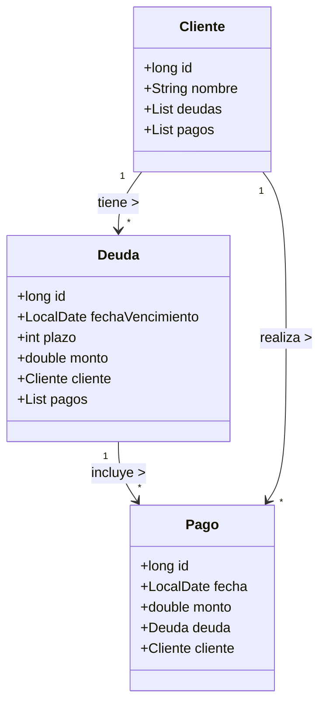

# Introducción

En esta guía se propone un conjunto de ejercicios para practicar la API **Stream** de Java 8
usando el patrón **Modelo‑Vista‑Controlador (MVC)**.  El propósito es que el
estudiante utilice operaciones funcionales como `forEach`, `filter`, `map`,
`sorted`, `collect`, `reduce` y `groupingBy` para procesar colecciones, evitando
las iteraciones externas con `for`, `while` o `do/while`.  La programación
funcional favorece la **iteración interna** y reduce los errores asociados a la
mutación de variables de control.

## Uso de `flatMap`

Uno de los métodos más útiles de la API `Stream` es `flatMap`, que permite
**aplanar** flujos de flujos.  Cuando una colección contiene otras colecciones
como elementos (por ejemplo, un cliente tiene muchas deudas), `map` generaría
un flujo de listas.  En cambio, `flatMap` toma cada lista, crea un flujo a
partir de ella y los concatena en un único flujo.  Esto facilita aplicar
operaciones sobre todos los elementos sin necesidad de bucles externos.

Por ejemplo, si se desea obtener un único flujo con **todas las deudas de todos
los clientes**, se puede escribir:

```java
List<Deuda> todasLasDeudas = clientes.stream()
    // obtenemos el Stream<Deuda> de cada cliente
    .flatMap(cliente -> cliente.getDeudas().stream())
    // recolectamos en una lista
    .collect(Collectors.toList());
```

`flatMap` también es útil para crear flujos de pagos combinados a partir de
todas las deudas de un cliente o de todos los clientes.  En el ejercicio
«Flujo combinado de todos los pagos» se propone precisamente usar esta
operación.

El modelo que se usará como base representa un sistema de **Clientes**,
**Deudas** y **Pagos**.  Las consultas planteadas se deben resolver únicamente con
la API de flujos (streams) de Java; no está permitido recorrer colecciones con
bucles externos.  Las clases del modelo forman el **Modelo** dentro del
patrón MVC; la **Vista** es responsable de presentar los resultados y el
**Controlador** conecta las interacciones de la vista con las operaciones del
modelo.

# Modelo de datos

El modelo contiene tres clases principales.  Las relaciones de asociación se
implementan mediante variables de instancia: una lista de objetos relacionados
en el lado de la relación de “uno a muchos” y una referencia al objeto
contenedor en el lado de “muchos a uno”.  Esta organización permite navegar en
ambos sentidos mediante flujos.

## Clase `Cliente`

- **id**: identificador único del cliente (por ejemplo, un `long`).
- **nombre**: nombre del cliente (`String`).
- **deudas**: lista (`List<Deuda>`) con todas las deudas del cliente.
- **pagos**: lista (`List<Pago>`) con todos los pagos que ha realizado el
  cliente.

## Clase `Deuda`

- **id**: identificador único de la deuda.
- **fechaVencimiento**: fecha en la que vence la deuda.
- **plazo**: período asociado a la deuda (días o meses según el contexto).
- **monto**: importe total de la deuda.
- **cliente**: referencia al cliente que contrajo la deuda.
- **pagos**: lista (`List<Pago>`) con los pagos aplicados a la deuda.

## Clase `Pago`

- **id**: identificador único del pago.
- **fecha**: fecha en que se realizó el pago.
- **monto**: importe del pago.
- **deuda**: referencia a la deuda a la que se aplica el pago.
- **cliente**: referencia al cliente que realizó el pago.

Esta estructura de datos permite obtener, por ejemplo, todas las deudas de un
cliente mediante `cliente.getDeudas()` y todos los pagos de una deuda mediante
`deuda.getPagos()`.  A su vez, cada pago conoce la deuda y el cliente al que
pertenece, lo que facilita crear flujos que crucen la información.

# Restricciones y requerimientos

1. **Prohibido usar bucles externos**: las soluciones deben emplear la API de
   flujos de Java (`Stream`, `IntStream`, etc.) y expresiones lambda para
   procesar las colecciones.  La iteración debe ser interna y declarativa.
2. **Modelo MVC**: las clases del modelo se implementan como se describió.
   Las consultas deben pertenecer a servicios o métodos del *Controlador*, y
   la *Vista* sólo debe invocar dichos métodos y mostrar resultados.
3. **Datos de ejemplo**: para probar las consultas se recomienda cargar un
   conjunto de clientes, deudas y pagos en memoria.  No obstante, las
   operaciones deben ser independientes de la fuente de datos (podrían
   aplicarse a bases de datos o archivos usando `stream()` de las colecciones
   leídas).
4. **Inmutabilidad**: salvo que se indique lo contrario, las operaciones
   funcionales no deben modificar las colecciones originales; utilice `map`,
   `filter` y `collect` para generar nuevas colecciones cuando sea necesario.

# Ejercicios propuestos

Cada ejercicio plantea una consulta o reporte que debe implementarse usando la
API de flujos.  Se sugieren nombres de métodos y clases, pero pueden
adaptarse según la implementación.  Todas las respuestas deben construirse
usando operaciones como `filter`, `map`, `sorted`, `distinct`, `collect`,
`reduce`, `findFirst`, `groupingBy`, `partitioningBy` y sus variantes
especializadas para tipos primitivos (`IntStream`, `DoubleStream`, etc.).

## 1. Listados básicos

1. **Lista de clientes ordenada alfabéticamente**.
    - Implemente un método que devuelva una lista de clientes ordenados por
      nombre ascendente.  Utilice `stream()`, `sorted(Comparator.comparing(...))`
      y `collect(Collectors.toList())`.

2. **Deudas de un cliente específico**.
    - Dado el `id` de un cliente, obtenga las deudas asociadas y ordénelas por
      fecha de vencimiento o por monto.  Use `filter` para localizar el
      cliente, luego `flatMap` para obtener su lista de deudas y `sorted` para
      aplicar el criterio de ordenamiento.

3. **Pagos de una deuda**.
    - Obtenga todos los pagos de una determinada deuda (por ejemplo, a partir
      del `id` de la deuda) y ordénelos por fecha de pago descendente.  Use
      `filter` para localizar la deuda y `flatMap` para obtener sus pagos.

4. **Maestro–detalle de deudas y pagos de un cliente**.
    - Para un cliente seleccionado, recorra sus deudas y muestre para cada
      deuda su monto, fecha de vencimiento y una lista de pagos asociados con
      su fecha y monto.  Use `forEach` y dentro del recorrido de deudas use
      `stream()` sobre la lista de pagos.

5. **Listado de clientes con cantidad de deudas y cantidad de pagos**.
    - Genere un flujo de clientes y para cada uno calcule, con `map`, la
      cantidad de deudas (`cliente.getDeudas().size()`) y la cantidad de pagos
      (`cliente.getPagos().size()`).  Devuelva una lista de objetos
      auxiliares o un `Map<Cliente, DatosCliente>` con estos valores.

## 2. Reportes agregados por cliente

En estos ejercicios se pide consolidar la información de deudas y pagos por
cliente.  Recuerde que el saldo pendiente de un cliente es la suma de los
monto de sus deudas menos la suma de sus pagos.

1. **Totales por cliente (versión completa)**.
    - Para cada cliente calcule:
        1. Monto total de sus deudas (suma de `deuda.getMonto()`).
        2. Monto total pagado (suma de `pago.getMonto()` de todos sus pagos).
        3. Saldo pendiente (diferencia entre los totales anteriores).
    - Use `mapToDouble` para obtener los totales y `collect` para construir
      un `List<ResumenCliente>` o un `Map<Cliente, Resumen>`.

2. **Totales filtrados por rango de fecha de vencimiento**.
    - Igual que el ejercicio anterior, pero sólo considere las deudas cuya
      fecha de vencimiento esté en un rango `[fechaInicio, fechaFin]`.
      **Importante:** al calcular el total pagado incluya todos los pagos de
      esas deudas, **independientemente** de la fecha del pago.

3. **Clientes morosos por rango de fecha**.
    - Extienda el punto anterior para que el reporte sólo incluya a los
      clientes cuyo saldo pendiente sea estrictamente mayor que cero.  Use
      `filter` para descartar los clientes al día.

4. **Top N clientes con mayor deuda pendiente**.
    - A partir del reporte completo del punto 2.1, ordene los clientes de
      manera descendente por saldo pendiente y devuelva los primeros *N*.
      Utilice `sorted((c1,c2) -> Double.compare(...))` y `limit(N)`.

## 3. Estadísticas y reducciones

1. **Promedio de pagos en un mes determinado**.
    - Dado un año y un número de mes, obtenga un flujo de todos los pagos
      realizados en ese periodo (puede usar `flatMap` sobre todos los clientes
      o sobre todas las deudas) y calcule el promedio del monto con
      `mapToDouble(Pago::getMonto).average()`.

2. **Número de clientes sin pagos**.
    - Calcule cuántos clientes nunca han realizado un pago.  Utilice `filter`
      para seleccionar los clientes con lista de pagos vacía y `count()`.

3. **Cliente con mayor deuda impaga**.
    - Determine el cliente cuyo saldo pendiente (sumatoria de deudas menos
      pagos) sea el mayor de todos.  Use `max(Comparator.comparingDouble(...))`.

4. **Deuda con mayor monto pendiente**.
    - De entre todas las deudas, calcule para cada una su saldo pendiente
      (monto de la deuda menos la suma de los pagos asociados) y obtenga la
      deuda con mayor saldo.  Use `map` para transformar cada deuda en una
      estructura `(Deuda, saldo)` y `max` para comparar por saldo.

5. **Suma total de todas las deudas vs. suma total de todos los pagos**.
    - Obtenga dos `DoubleSummaryStatistics` independientes: uno para los
      montos de todas las deudas y otro para los montos de todos los pagos.
      Compare sus valores de `getSum()` para verificar si el sistema está
      totalmente pagado.

## 4. Transformaciones y ordenamiento

1. **Nombres de clientes en mayúsculas sin repeticiones**.
    - Obtenga un flujo de clientes, mapéelos a `cliente.getNombre().toUpperCase()`
      y utilice `distinct()` para eliminar duplicados.  Devuelva la colección
      resultante en un `List<String>` o `Set<String>`.

2. **Deudas más grandes de un cliente**.
    - Para un cliente dado, ordene sus deudas de mayor a menor por monto y
      devuelva las tres mayores (`limit(3)`).

3. **Pagos más recientes de un cliente**.
    - Ordene la lista de pagos del cliente en orden descendente por fecha y
      devuelva los últimos cinco pagos o menos (`limit(5)`).

4. **Fechas de vencimiento únicas**.
    - Obtenga un flujo de todas las deudas de todos los clientes, mapéelas a
      su fecha de vencimiento y elimine repeticiones con `distinct()`.  El
      resultado puede ser una lista de fechas o un conjunto (`Set<LocalDate>`).

## 5. Agrupamiento y particionado

1. **Deudas por año de vencimiento**.
    - Agrupe todas las deudas de todos los clientes por el año de su fecha de
      vencimiento y obtenga, para cada año, cuántas deudas existen.  Use
      `Collectors.groupingBy(deuda -> deuda.getFechaVencimiento().getYear(), Collectors.counting())`.

2. **Pagos totales por mes y año**.
    - Agrupe todos los pagos por mes y año (`YearMonth`) de su fecha y
      calcule la suma de los montos de cada grupo usando
      `Collectors.groupingBy(YearMonth::from, Collectors.summingDouble(Pago::getMonto))`.

3. **Clientes al día vs. clientes morosos**.
    - Use `Collectors.partitioningBy` con un predicado que determine si el
      cliente tiene saldo pendiente (`totalDeudas > totalPagos`).  Obtenga un
      mapa con dos entradas: `true` para morosos y `false` para clientes al día;
      el valor asociado puede ser una lista de clientes o su conteo.

4. **Pagos agrupados por cliente**.
    - Cree un `Map<Cliente, List<Pago>>` donde la clave es el cliente y el
      valor es la lista de todos sus pagos.  Utilice
      `Collectors.groupingBy(Pago::getCliente)` sobre un flujo que combine todos
      los pagos (por ejemplo, usando `flatMap(cliente -> cliente.getPagos().stream())`).

## 6. Búsqueda con `findFirst` y `Optional`

1. **Primer cliente con una deuda vencida en un rango**.
    - Dado un intervalo de fechas, encuentre el primer cliente que tenga al
      menos una deuda con fecha de vencimiento dentro del intervalo.  Use
      `filter` en el flujo de clientes y `anyMatch` para verificar si alguna
      de sus deudas cumple la condición.  Luego aplique `findFirst()` sobre el
      flujo filtrado.

2. **Primer pago que supera un monto determinado**.
    - A partir de un flujo combinado de todos los pagos, aplique `filter` para
      conservar sólo los pagos cuyo monto sea mayor que un valor dado y use
      `findFirst()` para obtener el primer caso.  Recuerde que el resultado
      será un `Optional<Pago>`.


## 7. Desafíos adicionales

1. **Flujo combinado de todos los pagos**.
    - A partir de la colección de clientes, cree un único flujo con todos los
      pagos utilizando `flatMap(cliente -> cliente.getPagos().stream())`.
      Sobre este flujo calcule estadísticas como la suma, el promedio, el pago
      mínimo y el máximo usando `DoubleSummaryStatistics` o las operaciones
      `sum()`, `average()`, `min()`, `max()` y `count()`.

2. **Agrupar deudas por estado (pagadas o con saldo)**.
    - Para cada deuda determine su saldo pendiente y utilice
      `Collectors.partitioningBy(deuda -> deuda.getSaldo() > 0)` para obtener
      dos grupos: deudas totalmente pagadas y deudas con saldo.  Muestre el
      número de deudas en cada grupo y, opcionalmente, las listas de deudas.

3. **Obtener un `Map<Cliente, Double>` con el monto total pagado**.
    - A partir de la lista de pagos global, agrupe por cliente y utilice
      `Collectors.summingDouble(Pago::getMonto)` para calcular cuánto ha
      pagado cada cliente en total.

4. **Clientes con más de *k* deudas**.
    - Filtre la lista de clientes para quedarse con aquellos cuya lista de
      deudas tenga más de *k* elementos.  Este filtro se puede combinar con
      algún ordenamiento (por ejemplo, descender en cantidad de deudas) y
      `limit(n)` para obtener los clientes más endeudados en número de
      compromisos.

5. **Clientes sin ninguna deuda**.
    - Identifique los clientes cuya lista de deudas está vacía mediante
      `filter` y devuelva la lista resultante.  Estos clientes podrían tener
      pagos correspondientes a deudas que ya fueron eliminadas; la consulta
      puede adaptarse según la lógica del dominio.

# Diagrama de clases

Para visualizar las relaciones entre las clases `Cliente`, `Deuda` y `Pago`, a
continuación se presenta un diagrama en formato **Mermaid**.  El diagrama
refleja las multiplicidades de cada asociación (un cliente tiene muchas deudas
y muchos pagos; una deuda pertenece a un único cliente y tiene muchos pagos;
un pago pertenece a un único cliente y a una única deuda).



# Trabajo a realizar

El trabajo a realizar es el siguiente:
1. Implementar el modelo descrito en un paquete llamado modelo
2. Implementar las soluciones a las consultas dentro de una clase Controlador <<singleton>> dentro del paquete controlador.
3. Implemente una vista que con un menú que permita, llamando al controlador, cargar datos y ejecutar las consultas. Los datos a cargar puden estar en una función o en un archivo, como decida el estudiante
4. Debe respetar las restricciones del programa:
   * Respetar MVC
   * No usar ciclos en el controlador para responder a las consultas.

Los ejercicios anteriores cubren las operaciones fundamentales de la API
`Stream` descritas en el capítulo sobre lambdas y flujos:
se trabaja con flujos de objetos (`Stream<Cliente>`, `Stream<Deuda>`,
`Stream<Pago>`), se aplican operaciones intermedias (`filter`, `map`,
`sorted`, `distinct`) y terminales (`forEach`, `collect`, `reduce`,
`count`, `sum`, `average`, `max`, `min`), así como agrupamientos y
reducciones adicionales (`groupingBy`, `partitioningBy`).  Además,
se utilizan flujos especializados como `IntStream` y `DoubleStream`, y se
promueve la iteración interna para evitar los errores comunes de los bucles externo. 
Implementar estas consultas en un contexto MVC
favorece la separación de responsabilidades y permite construir
aplicaciones limpias y mantenibles.